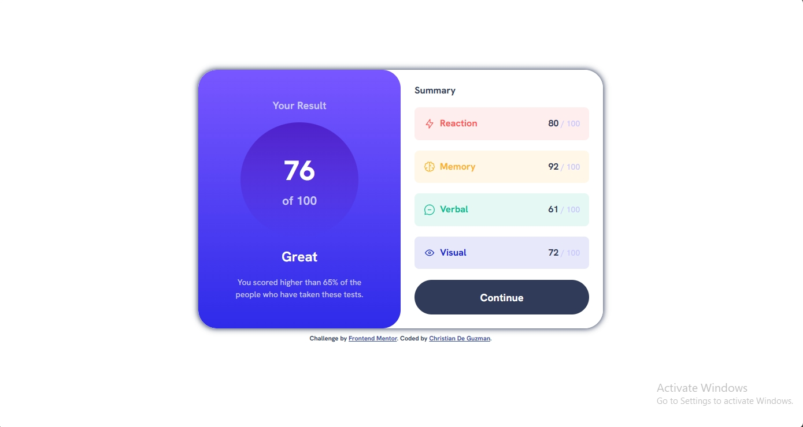
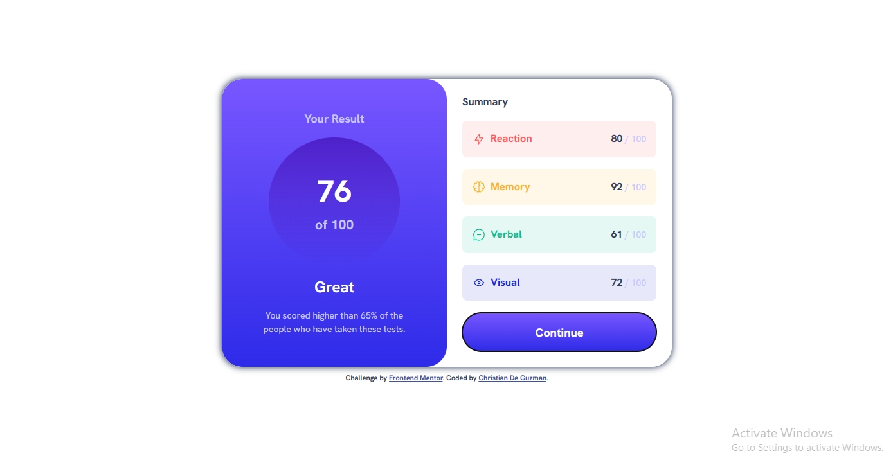
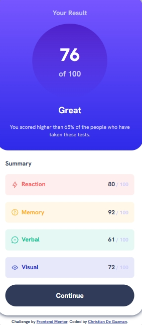

# Frontend Mentor - Results summary component solution

This is a solution to the [Results summary component challenge on Frontend Mentor](https://www.frontendmentor.io/challenges/results-summary-component-CE_K6s0maV). Frontend Mentor challenges help you improve your coding skills by building realistic projects.

## Table of contents

- [Overview](#overview)
  - [The challenge](#the-challenge)
  - [Screenshot](#screenshot)
  - [Links](#links)
- [My process](#my-process)
  - [Built with](#built-with)
  - [What I learned](#what-i-learned)
  - [Continued development](#continued-development)
  - [Useful resources](#useful-resources)
- [Author](#author)
- [Acknowledgments](#acknowledgments)

## Overview

### The challenge

Users should be able to:

- View the optimal layout for the interface depending on their device's screen size
- See hover and focus states for all interactive elements on the page
- **Bonus**: Use the local JSON data to dynamically populate the content

### Screenshot





### Links

- Solution URL: [Add solution URL here](https://your-solution-url.com)
- Live Site URL: [Add live site URL here](https://your-live-site-url.com)

## My process

### Built with

- Semantic HTML5 markup
- CSS custom properties
- Flexbox
- CSS Grid
- Mobile-first workflow

### What I learned

Some of this code where inspired by [Kevin Powell](https://www.youtube.com/@KevinPowell) on YouTube when he take one of the [challenge](https://www.youtube.com/watch?v=B2WL6KkqhLQ&t=5s) from Frontend Mentor and the way he code and think what to use is really inspiring. Even though I feel like I need more experience to have that confident like he does when he take such challenge by Frontend Mentor.

Here are some codes that I'm really fond of:

```html
<section class="summary">
  <h1 class="summary__title">Summary</h1>
  <div class="summary__section">
    <div class="flex-group red-bg">
      <div class="summary__hero">
        
        <h1 class="red-txt">Reaction</h1>
      </div>
      <p><span class="summary__score">80</span> / <span>100</span></p>
    </div>
  </div>
  <!-- rest of the code -->
</section>
```

> This part of my `index.html`, I haven't do this kind of nesting and naming using `class` as you can see in this part but it kind of make sense especially when I'm to style this individual HTML element, rather than using the element itself, make a class name then style it. _Is that make sense?_

**ALSO**

> Forgot to mention, I never heard **BEM** before until I watch Mr.Kevin Powell taking other challenge from Frontend Mentor and he mention about this **BEM**, and according to my research that the goal of naming class like this for example `class="summary__title"` is to make the code _redable_, _maintainable_, and _easy to understand_.

```css
.card {
  --card-padding: 1.5rem;
  --card-border-radius: 2rem;
  --card-linear-gradient: linear-gradient(
    var(--clr-gradients-900-bg),
    var(--clr-gradients-500-bg)
  );

  border-radius: var(--card-border-radius);
  overflow: hidden;

  display: grid;
  max-width: 700px;

  margin: -7px;

  box-shadow: 0 0 10px 1px var(--clr-neutral-800);
}
```

> In this part of my `style.css`, I haven't think to create a varibale inside of a selector (in this case `.card`). According to my research, doing this kind of style where you create a variable inside of a CSS selector is a great practice for encapsulating style and making them more maintainable.

### Continued development

Despite having a success from this challenge, there still things that needs to consider and to improve. In this section of README-template, here are some of the things that I think needs to improve:

```html
<p class="card__description">
  You scored higher than 65% of the people who have taken these tests.
</p>
```

I'm not sure how can I able to mimic the design provided by Frontend Mentor especially with this one, where the <p> element content where a little bit wider compare to the design.

> I try to add `max-width` inside of `card__description` but I think it overwrites the `max-width` from `card` causing it to follow the `max-width` value of the `card_description`. That's why I only left it with `text-align` for now.

**ALSO**

```html
<section class="card__result">
  <h1 class="card__title">Your Result</h1>
  <div class="score">
    <h1 class="score__hero">76</h1>
    <h2>of <span class="score__over">100</span></h2>
  </div>
  <h1 class="card__message">Great</h1>
  <p class="card__description">
    You scored higher than 65% of the people who have taken these tests.
  </p>
</section>
```

> I think the whole `card__result` need some adjustment, especially with the _<h1>, <h2>,_ and _<p>_. I'm not quite satisfied with the font-size of these said HTML element, but nonetheless I somehow manage to re-create the design by Frontend Mentor, so that's a big win for me.

**ALSO**

> The _semantics_ of HTML, I haven't given a thought or time yet to add **accessibility** to my `index.html` and `style.css`. There still a lot of improvement that may take on this one, but overall it looks great in my opinion.

### Useful resources

- [CSS Custom Reset](https://www.joshwcomeau.com/css/custom-css-reset/) - This site really useful in terms of making a custom CSS reset, making styling consistent throughout.
- [W3School](https://www.w3schools.com/) - This site really helps me out remembering and refreshing stuff that I've sometimes forget to use. In terms of using HTML, CSS or JS, this is my go-to-site
- [MDN Web Docs](https://developer.mozilla.org/en-US/docs/Web/Manifest) - This is my secondary go-to-site when I need in depth explanation of a certain code, especially with CSS or JS.

**Note: Delete this note and replace the list above with resources that helped you during the challenge. These could come in handy for anyone viewing your solution or for yourself when you look back on this project in the future.**

## Author

- Website - [Netlify - Fate](https://jazzy-hummingbird-d17433.netlify.app/)
- Frontend Mentor - [@SerPet-eng](https://www.frontendmentor.io/profile/SerPet-eng)
- Twitter - [@dchristian796](https://twitter.com/dchristian796)

## Acknowledgments

I want to acknowledge my family and friends for supporting me and for my specific inspiration in terms of Frontend Developing. First of [Hattori Hanzo](https://www.facebook.com/areyes2022) and [Kevin Powell](https://www.youtube.com/@KevinPowell)
